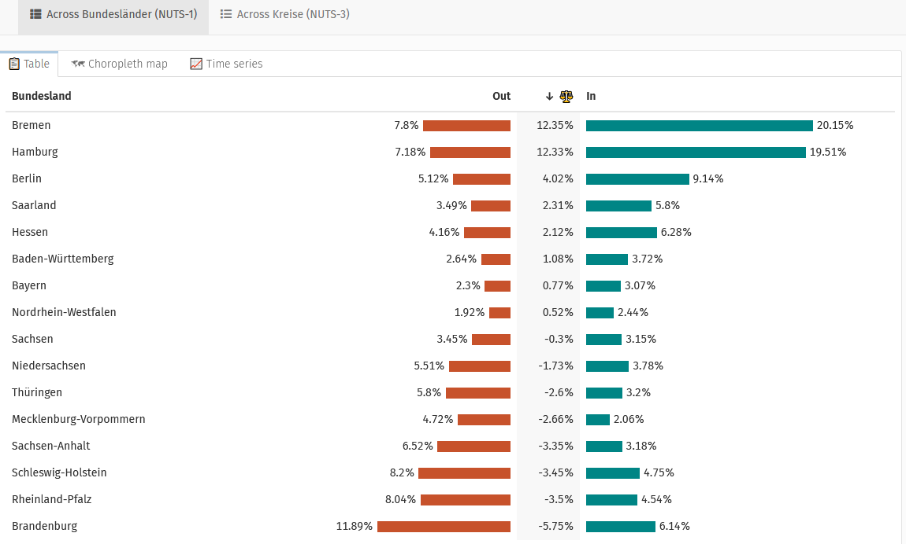
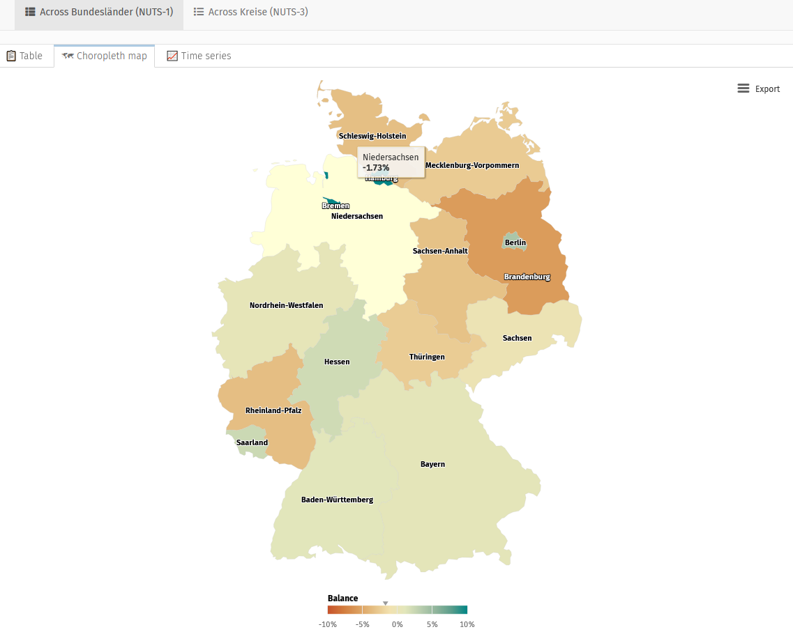
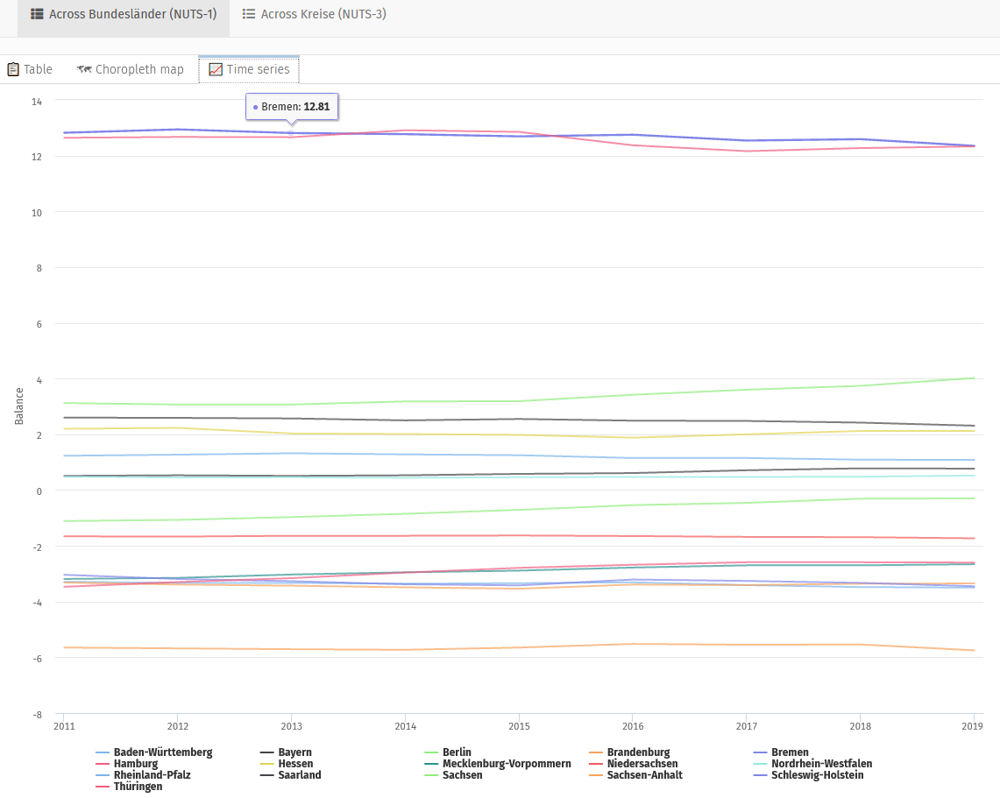
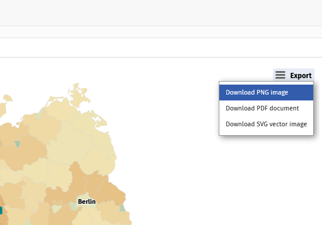

# CorrelAid X Challenge Bremen

This interactive dashboard visualizes how many people have been commuting between states and districts in Germany. Data source: Bundesagentur für Arbeit; access via the [datenguidepy](https://github.com/CorrelAid/datenguide-python) package.

This is an entry for the CorrelAidX Challenge 2020 by CorrelAidX Bremen.

## Link to online dashboard

[Dashboard on shinyapps.io](https://long39ng.shinyapps.io/pendlerstat_de/)

## Running the dashboard on your computer

Clone this repository or download all files.

To get data using datenguidepy, run the [Python script](https://github.com/CorrelAid/correlaidx-challenge-bremen/blob/master/scripts/get_data.py). This is only an interim solution. Ideally, the data would be queried directly when running the dashboard. That is technically doable with reticulate. However, using datenguidepy to query data inside hosted shiny apps/documents is not possible at the moment because the shinyapps.io server does not have Python>=3.6.1, which is a requirement for pandas>=1.0.0 and datenguidepy.

Having the datasets in the same directory as the [pndl_dashboard.Rmd](https://github.com/CorrelAid/correlaidx-challenge-bremen/blob/master/pndl_dashboard.Rmd) Rmarkdown file, it can be run in R with `rmarkdown::run(file = "pndl_dashboard.Rmd")` or using the "Run Document" button in RStudio.

## How to use

With our application you can gain insights into commuting behaviour in Germany, both on the level of "Länder" (NUTS-1) and "Kreise" (NUTS-3). You can visualize data as sortable tables with bar plots or presented as a map (zoomable for NUTS-3).  

 

For NUTS-1 there is also a time-series graph available.  

The panel on the left lets you choose  
… a year between 2011 and 2019 for which numbers are shown  
… whether to show commuter inflow, outflow, or balance  
… whether numbers are absolute or in proportion to the regions populations  
… and if you like to download the data as a .csv-file.  

  

You can also download the maps as images in different file formats.

