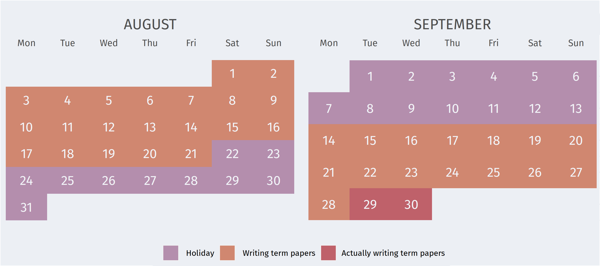

```{r setup, include=FALSE}
knitr::opts_chunk$set(include = FALSE)
options(htmltools.dir.version = FALSE)
```

```{r xaringan-themer}
library(xaringanthemer)

extra_css <- list(
  ".title-slide h1" = list(
    color = "#a3be8c",
    "font-size" = "50px",
    "text-shadow" = "none",
    "text-align" = "left",
    "margin-left" = "15px",
    "padding-top" = "60px"
  ),
  ".title-slide h2" = list(
    color = "#a3be8c",
    "text-shadow" = "none",
    "font-weight" = 300,
    "font-size" = "40px",
    "text-align" = "left",
    "margin-top" = "-20px",
    "margin-bottom" = "-10px",
    "margin-left" = "15px"
  ),
  ".title-slide h3" = list(
    color = "#8fbcbb",
    "text-shadow" = "none",
    "font-family" = "Fira Sans",
    "font-weight" = 300,
    "font-size" = "30px",
    "text-align" = "right",
    "margin-right" = "15px",
    "margin-bottom" = "-20px"
  ),
  # Horizontal line inspired by Metropolis theme
  "hr, .title-slide h2::after, .mline h1::after" = list(
    content = "''",
    display = "block",
    border = "none",
    "background-color" = "#ebcb8b",
    color = "#ebcb8b",
    height = "1px"
  ),
  "hr, .mline h1::after" = list(
    margin = "1em 15px 0 15px"
  ),
  ".title-slide h2::after" = list(
    margin = "15px 15px 35px 0"
  ),
  ".mline h1::after" = list(
    margin = "10px 15px 0 15px"
  ),
  # Code block background colour (highlightStyle: rainbow)
  ".hljs-rainbow .hljs" = list(
    background = "#434c5e"
  ),
  # Use tabular numbers
  body = list(
    "font-variant-numeric" = "tabular-nums"
  ),
  # Progress bar instead of slide number
  ".remark-slide-number" = list(
    position = "inherit"
  ),
  ".remark-slide-number .progress-bar-container" = list(
    position = "absolute",
    bottom = 0,
    height = "5px",
    display = "block",
    left = 0,
    right = 0
  ),
  ".remark-slide-number .progress-bar" = list(
    height = "100%",
    "background-color" = "#a3be8c"
  )
)

style_xaringan(
  text_color = "#2e3440",
  header_color = "#5e81ac",
  background_color = "#eceff4",
  link_color = "#5e81ac",
  text_bold_color = "#bf616a",
  code_highlight_color = "#81a1c160",
  code_inline_color = "#2e3440",
  code_inline_background_color = "#81a1c130",
  code_inline_font_size = "0.9em",
  inverse_background_color = "#2e3440",
  inverse_text_color = "#eceff4",
  inverse_header_color = "#a3be8c",
  left_column_subtle_color = "#81a1c1",
  left_column_selected_color = "#5e81ac",
  blockquote_left_border_color = "#b48ead",
  table_border_color = "#4c566a",
  table_row_border_color = "#4c566a",
  table_row_even_background_color = "#e5e9f0",
  base_font_size = "25px",
  text_font_size = "1rem",
  header_h1_font_size = "2rem",
  header_background_auto = TRUE,
  header_background_color = "#2e3440",
  header_background_text_color = "#a3be8c",
  header_background_padding = "0.8rem 64px 0.6rem",
  header_background_content_padding_top = "6rem",
  header_h2_font_size = "1.6rem",
  header_h3_font_size = "1.25rem",
  text_font_family = "Fira Sans",
  text_font_url = "https://code.cdn.mozilla.net/fonts/fira.css",
  header_font_family = "Zilla Slab",
  header_font_url = "https://code.cdn.mozilla.net/fonts/zilla-slab.css",
  code_font_family = "Fira Code",
  code_font_url = "https://cdn.jsdelivr.net/gh/tonsky/FiraCode@4/distr/fira_code.css",
  extra_css = extra_css
)
```

background-image: url(figs/dashboard.png)
background-size: contain

---
class: center, inverse, middle, mline

# What?

---

# "Commuter" statistics

Source: German Federal Employment Agency

**commuters:**

> employees whose workplace is located in a different municipality from the one in which they live

--

> regardless of whether and how often they actually commute ¯\\\_(ツ)_/¯

---
class: center, inverse, middle, mline

# Why?

---

# Why commuter statistics?

- Identify regionally important industry/business locations

- Compare the relative importance of districts/states for work

--

- For Bremen especially interesting:  
  commuting between suburbs ("Speckgürtel") and urban area

---

# Why a dashboard?

```{r calendar}
library(ggplot2)
library(calendR)

events <- vector(length = 61)
events[c(1:23, 44:59)] <- " Writing term papers"
events[22:44] <- " Holiday"
events[60:61] <- "Actually writing term papers"

calendar <- calendR(start_date = "2020-08-01", end_date = "2020-09-30",
                    start = "M",
                    title = NULL,
                    special.days = events,
                    special.col = c("#B48EAD", "#D08770", "#BF616A"),
                    lty = 0,
                    font.family = "Fira Sans",
                    days.col = "#F2F4F8", day.size = 5,
                    months.size = 16,
                    legend.pos = "bottom",
                    col = "#eceff4", mbg.col = "#eceff4", bg.col = "#eceff4",
                    margin = 0) +
  theme(legend.background = element_rect(fill = "#eceff4"))

ggsave("calendar.png", calendar, path = "figs", width = 9, height = 4)
```

<div style="text-align:center">
  
</div>

---
class: center, inverse, middle, mline

# How?

---

# Collecting commuter data with <span style='font-family:var(--code-font-family);font-size:0.75em;color:#8fbcbb;'>datenguidepy</span>

- Ginormous collection of regional statistics at different administrative levels

--

- Querying data is straightforward
  
  - <span style='font-size:0.8em'>... but may take some time with a large number of regions and/or indicators</span>

--

- Regions can change their IDs at some point in time `r emo::ji("scream")`

---

# Creating a dashboard with <span style='font-family:var(--code-font-family);font-size:0.75em;color:#8fbcbb;'>flexdashboard</span> & <span style='font-family:var(--code-font-family);font-size:0.75em;color:#8fbcbb;'>shiny</span>

- `{flexdashboard}`: easier than `{shinydashboard}`

--

- `runtime: shiny_prerendered` for interactivity
  
  - <span style='font-size:0.8em'>and speed `r emo::ji("rocket")` (compared to `runtime: shiny`)</span>

--

- `{reactable}`: default looks nicer than `{DT}`

- `{highcharter}`: default looks nicer than `{plotly}`

---
class: center, inverse, middle, mline

# What we learned

---
class: middle

- A lot about "commuting" patterns in Germany
  
  - <span style='font-size:0.8em'>What about 2020?</span>

--

- Python is cool, `pandas` is cool, `datenguidepy` is cool

--

- **Open, accessible data is important!** (Thanks [Datenguide](https://datengui.de/)!)

---
class: center, middle

`r emo::ji("point_right")` [**commute.correlaid.org**](https://commute.correlaid.org)

Source code: https://github.com/CorrelAid/correlaidx-challenge-bremen


